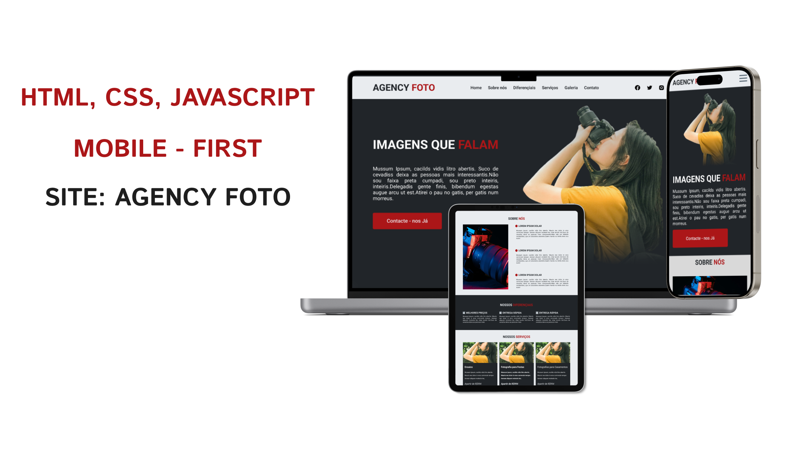

# [Projeto-site-agency-foto](https://agency-foto.vercel.app)

Esses dias resolvi criar um desafio para mim para por em praática e relembrar alguns conhecimentos de FrontEnd. Então pensei e tive a ideia de criar um site de uma empresa fictícia no ramo da fotografia abri o meu figma e começei a criar a prototipação do site eu não sou design então deu um pouco de trabalho levei um tres dias kkkk.

Depoís disso precissava desenvolver o site tranformar o layout em codigo e consegui... Me diverti bastante fazendo este projeto alem de aprender e relembrar alguns conceitos resolvi compartilhar a o resultado final.

[Clica Aqui](https://agency-foto.vercel.app). para ver o site no ar.

## O Que é a Agency Foto

Agency Foto é uma empresa fictícia de fotos, especializada em fotos para festas, casamentos, ensaios e mais. Esse projeto consiste de um site responsivo utilizando a metodologia mobile-first, ou seja, ele é desenvolvido primeiro para dispositivos mobile e depois para telas maiores. Esse site é composto por Navbar, Hero Section, Sobre Nós, Nossos Diferenciais, Nossos Serviços, Newsletter, Galeria e Footer.

* Você pode ver o resultado final deste projeto [Clicando Aqui](https://agency-foto.vercel.app)

## O que eu aprendi e pratiquei durante este projeto:

### CSS

* Variáveis CSS
* Unidades CSS (rem, %, vh, px)
* Metologia BEM
* Media Queries
* Flexbox

### Javascript

* querySelector()
* querySelectorAll()
* addEventListener()
* add()
* remove()
* toggle()
* contains()

E muito mais.

Espero que goste e se precisar de contribuir ou clonar para reutilizar esteja avontade. Por favor, marque-me no [Twitter](https://twitter.com/mussinady)(@mussinady) ou no [Linkedin](https://www.linkedin.com/in/mussinadyabubacar). 😉